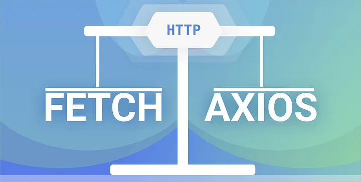

### Task02 - API calls with fetch and axios.



**_AXIOS_**

- Axios is a `third-party` HTTP client library for making network requests. It is promise-based and provides a clean and consistent API for handling requests and responses.

- You can add it to your project via a content distribution network (CDN) or by using a package manager (like npm).

**_FETCH_**

- `Fetch`, like Axios, is a`promise-based`HTTP client. It is a built-in API; hence we don’t have to install or import anything. It’s available in all modern browsers;

- Let’s now compare their basic syntax, features, and use cases as we try to understand the two popularly used libraries.

#### Basic Syntax

**_Using Fetch_**

```import React, { useEffect, useState } from 'react';

const FetchExample = () => {
  const [data, setData] = useState(null);
  const [loading, setLoading] = useState(true);
  const [error, setError] = useState(null);

  useEffect(() => {
    fetch('https://api.example.com/data')
      .then((response) => {
        if (!response.ok) {
          throw new Error('Network response was not ok');
        }
        return response.json();
      })
      .then((data) => {
        setData(data);
        setLoading(false);
      })
      .catch((error) => {
        setError(error);
        setLoading(false);
      });
  }, []);

  if (loading) return <p>Loading...</p>;
  if (error) return <p>Error: {error.message}</p>;

  return (
    <div>
      <h1>Data from Fetch</h1>
      <pre>{JSON.stringify(data, null, 2)}</pre>
    </div>
  );
};

export default FetchExample;
```

**_Using axios_**

- First, install axios if you haven't already:

```
npm install axios

```

- Then, you can use it in your component like this:

```
import React, { useEffect, useState } from 'react';
import axios from 'axios';

const AxiosExample = () => {
  const [data, setData] = useState(null);
  const [loading, setLoading] = useState(true);
  const [error, setError] = useState(null);

  useEffect(() => {
    axios.get('https://api.example.com/data')
      .then((response) => {
        setData(response.data);
        setLoading(false);
      })
      .catch((error) => {
        setError(error);
        setLoading(false);
      });
  }, []);

  if (loading) return <p>Loading...</p>;
  if (error) return <p>Error: {error.message}</p>;

  return (
    <div>
      <h1>Data from Axios</h1>
      <pre>{JSON.stringify(data, null, 2)}</pre>
    </div>
  );
};

export default AxiosExample;
```

**_Summary_**

- fetch is a built-in JavaScript function for making network requests.
- axios is a popular third-party library that simplifies HTTP requests and provides additional features not available in fetch
